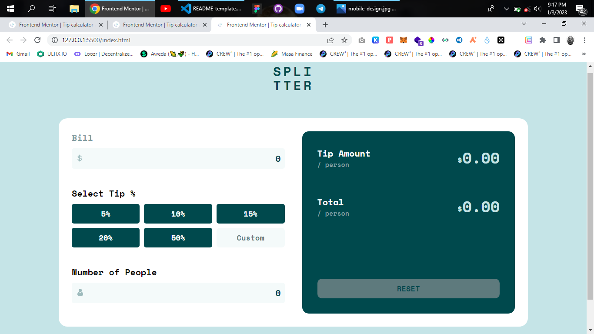

# Frontend Mentor - Tip calculator app solution

This is a solution to the [Tip calculator app challenge on Frontend Mentor](https://www.frontendmentor.io/challenges/tip-calculator-app-ugJNGbJUX). Frontend Mentor challenges help you improve your coding skills by building realistic projects.

## Table of contents

-    [Overview](#overview)
     -    [The challenge](#the-challenge)
     -    [Screenshot](#screenshot)
     -    [Links](#links)
     -    [Built with](#built-with)
     -    [What I learned](#what-i-learned)
     -    [Continued development](#continued-development)
     -    [Useful resources](#useful-resources)
-    [Author](#author)


## Overview

### The challenge

Users should be able to:

-    View the optimal layout for the app depending on their device's screen size
-    See hover states for all interactive elements on the page
-    Calculate the correct tip and total cost of the bill per person

### Screenshot



### Links

-    Solution URL: [Tip Calculator App](https://github.com/buk-ola01/Tip-Calculator-App)
-    Live Site URL:[Tip Calculator App](https://buk-ola01.github.io/Tip-Calculator-App)

## My process

### Built with

-    Semantic HTML5 markup
-    CSS custom properties
-    Flexbox
-    CSS Grid
-    Vanilla JS

### What I learned

-    Learnt how to use .forEach() function

```js
const array = [a, r, r, a, y];
array.forEach((item) => {
     return item * 2;
});
```

-    Learnt how to clear the arrow in <input type="number">

```css
input::-webkit-inner-spin-button,
input::-webkit-outer-spin-button {
     appearance: none;
     -webkit-appearance: none;
     -moz-appearance: none;
}
```

-    Learnt some form validation using Javascript

### Continued development

Looking forward to expand this later in the future

### Useful resources

-    [Resource](https://www.javascript.info) - This helped with the validation of the inputs. I really liked this pattern and will use it going forward.

## Author

-    Github - [@buk-ola01](https://github.com/buk-ola01)
-    Frontend Mentor - [@buk-ola01](https://www.frontendmentor.io/profile/buk-ola01)
-    Twitter - [@JimohAbdulsam1](https://twitter.com/JimohAbdulsam1)
